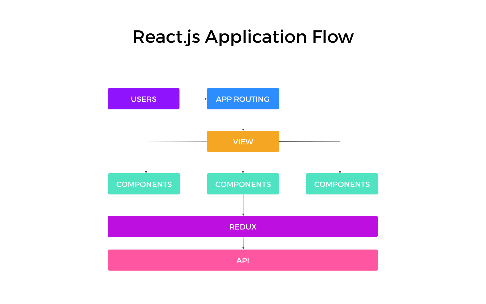
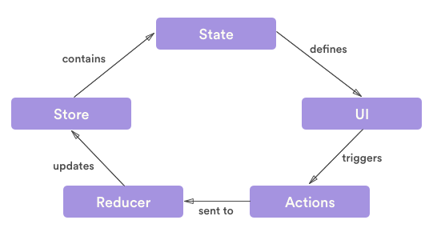
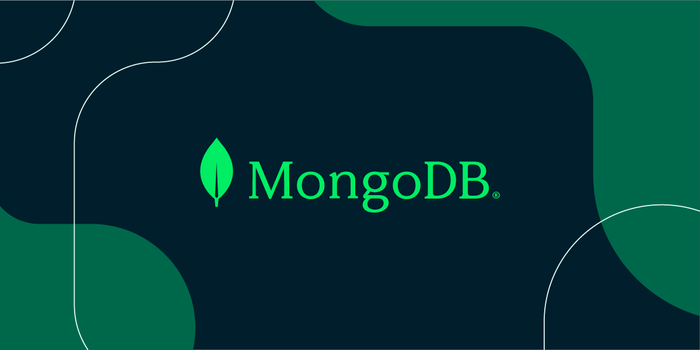

# YuanpengShop

An eCommerce platform built with the MERN stack & Redux.

## App Demo


## Architecture Diagram

**Frontend**: React.js (HTML, CSS, JavaScript), Redux, Axios

**Backend**: Node.js, Express.js, Mongoose, MongoDB, JWT

**Developer Tools**: Visual Studio Code, Postman, Git/Github, Render Cloud


## MERN stack

MERN stands for MongoDB, Express, React, Node, after the four key technologies that make up the stack.

- MongoDB — document database
- Express(.js) — Node.js web framework
- React(.js) — a client-side JavaScript framework
- Node(.js) — the premier JavaScript web server

Express and Node make up the middle (application) tier. Express.js is a server-side web framework, and Node.js is the popular and powerful JavaScript server platform. Regardless of which variant you choose, ME(RVA)N is the ideal approach to working with JavaScript and JSON, all the way through.


## React

React is a JavaScript library created by Facebook.

React is a User Interface (UI) library and is a tool for building UI components.



**Asynchronous**

async, await, promise

cart, order, shipping

**Prop drilling**

redux, state management

## Redux

Redux is a pattern and library for managing and updating application state, using events called "actions". It serves as a centralized store for state that needs to be used across your entire application, with rules ensuring that the state can only be updated in a predictable fashion.

- State, the source of truth that drives our app
- View, a declarative description of the UI based on the current state
- Action, the events that occur in the app based on user input, and trigger updates in the state. Actions are plain JavaScript objects that must have: 1. A type property to indicate the type of action to be carried out 2. A payload object that contains the information that should be used to change the state. Here’s an example of an action:
  ```
  const addAction = { 
    type: "INCREMENT",
    payload: {
      incrementBy: 5,
    }
  }
  ```
- Action creator, is a function that creates and returns an action object. And here is an example of an action creator. It is just a helper function that returns the action:
  ```
  const getIncrementAction = (numberToIncrement) => {
    return {
      type: "INCREMENT",
      payload: {
        incrementBy: numberToIncrement,
      }
    }
  }
  ```
- Dispatch, the Redux store has a method called dispatch. The only way to update the state is to call ``` store.dispatch()```  and pass in an action object. The store will run its reducer function and save the new state value inside, and we can call ``` getState() ``` to retrieve the updated value. We can read data from the store with ``` useSelector() ```
  ```
  store.dispatch({ type: 'counter/incremented' })
  ```
- Reducer, is a function that receives the current state and an action object, decides how to update the state if necessary, and returns the new state. You can think of a reducer as an event listener which handles events based on the received action (event) type. Here is an example of how reducers work in Redux:
  ```
  const CounterReducer = (state = initialState, action) => {
      switch (action.type) {
        // This reducer handles any action with type "LOGIN"
        case "INCREMENT":
            return state + action.incrementBy ? action.incrementBy : 1
        case "DECREMENT":
            return state + action.decrementBy ? action.decrementBy : 1
        default:
            return state
        } 
  }
  ```
- Store, the current Redux application state lives in an object called the store. The store is created by passing in a reducer and has a method called getState that returns the current state value.
  ```
  const store = createStore { reducer: counterReducer })
  console.log(store.getState())
  // {value: 0}
  ```
- Selectors, are functions that know how to extract specific pieces of information from a store state value. As an application grows bigger, this can help avoid repeating logic as different parts of the app need to read the same data.
  ```
  const selectCounterValue = state => state.value
  const currentValue = selectCounterValue(store.getState())
  console.log(currentValue)
  // 2
  ```
- thunkMiddleware from 'redux-thunk'. Redux has an official version of that "async function middleware", called the Redux "Thunk" middleware. The thunk middleware allows us to write functions that get dispatch and getState as arguments. The thunk functions can have any async logic we want inside, and that logic can dispatch actions and read the store state as needed. Writing async logic as thunk functions allows us to reuse that logic without knowing what Redux store we're using ahead of time. Please see [Using the Redux Thunk Middleware](https://redux.js.org/tutorials/fundamentals/part-6-async-logic#using-the-redux-thunk-middleware) for more detail.
  
  src/store.js
  ```
  import { createStore, applyMiddleware } from 'redux'
  import thunkMiddleware from 'redux-thunk'
  import { composeWithDevTools } from 'redux-devtools-extension'
  import rootReducer from './reducer'

  // Configuring the Store
  const composedEnhancer = composeWithDevTools(applyMiddleware(thunkMiddleware))
  // The store now has the ability to accept thunk functions in `dispatch`
  const store = createStore(rootReducer, composedEnhancer)
  export default store
  ```
  src/features/todos/todosSlice.js
  ```
  import { client } from '../../api/client'

  // Fetching Todos from a Server
  const initialState = []
  export default function todosReducer(state = initialState, action) {
    // omit reducer logic
  }
  // Thunk function
  export async function fetchTodos(dispatch, getState) {
    const response = await client.get('/fakeApi/todos')
    dispatch({ type: 'todos/todosLoaded', payload: response.todos })
  }
  ```
  src/index.js
  ```
  import React from 'react'
  import ReactDOM from 'react-dom'
  import { Provider } from 'react-redux'
  import './index.css'
  import App from './App'
  import './api/server'
  import store from './store'
  import { fetchTodos } from './features/todos/todosSlice'
  
  store.dispatch(fetchTodos)
  
  ReactDOM.render(
    <React.StrictMode>
      <Provider store={store}>
        <App />
      </Provider>
    </React.StrictMode>,
    document.getElementById('root')
  )
  ``` 
  


For Redux specifically, we can describe the sequence of steps to update the app detail:

- Initial setup:
1. A Redux store is created using a root reducer function.
2. The store calls the root reducer once, and saves the return value as its initial state.
3. When the UI is first rendered, UI components access the current state of the Redux store, and use that data to decide what to render. They also subscribe to any future store updates so they can know if the state has changed.
- Updates:
4. Something happens in the app, such as a user clicking a button.
5. The app code dispatches an action to the Redux store, like ```dispatch({type: 'counter/incremented'})```.
6. Once that dispatched value reaches a middleware, it can make an async call, and then dispatch a real action object when the async call completes.
8. The store runs the reducer function again with the previous state and the current action, and saves the return value as the new state.
9. The store notifies all parts of the UI that are subscribed that the store has been updated.
10. Each UI component that needs data from the store checks to see if the parts of the state they need have changed.
11. Each component that sees its data has changed forces a re-render with the new data, so it can update what's shown on the screen.

Here's what that data flow looks like visually:


## Axios


Axios is an HTTP client, which means it's used to make ***requests***. It works both in Node and in the browser and exposes a Promise interface.


## Node.js

**Express.js**

Express.js is used to create HTTP server applications. That means something that runs on a machine somewhere that ***responds*** to requests. It is designed for building web applications and APIs. Some of the features it provides includes:

- Allows to set up middlewares to respond to HTTP Requests. These middlewares work according to the sequence of implementation
- Defines routing which is used to perform different actions based on HTTP Verbs and URLs.
- Allows to dynamically render HTML Pages using templates.

## MongoDB & Mongoose

**MongoDB**

MongoDB is a popular document-oriented database that stores data in collections of JSON-like documents. It provides a flexible and scalable way to store data, making it ideal for building web applications and other data-driven systems.

**Mongoose**

Mongoose, on the other hand, is an Object Data Modeling (ODM) library that provides a higher-level abstraction layer on top of MongoDB. It allows developers to define their data models using a schema-based approach and provides a rich set of features that simplify the process of working with MongoDB, such as middleware functions to assist in handling pre-and post-processing of data, virtual properties enable developers to define computed fields, query builders to help construct complex queries with ease, and schema validation to apply validation rules to ensure data integrity and consistency. Together, MongoDB and Mongoose provide a powerful solution for managing data in modern web applications.

**Schema**

A schema in Mongoose is a blueprint that defines the structure and rules for a collection in a MongoDB database. It specifies the fields that a document in the collection should have, along with their data types and any validation rules that apply. Schemas can also define default values for fields and specify whether a field is required or optional. Once a schema is defined, it can be used to create a model, which is a constructor function that enables developers to create and manipulate documents in the corresponding MongoDB collection. **A model** in Mongoose is created by calling the ```mongoose. model()``` method and passing in the name of the collection and the corresponding schema.

**CRUD Operations**

Models can be used to perform a wide range of operations on a MongoDB database, such as creating, reading, updating, and deleting documents. They also support a variety of query building and execution features, such as ```find()```, ```findOne()```, and ```aggregate()```, which enables developers to retrieve and manipulate data flexibly and efficiently.



**Benefits of NoSQL databases**

- Flexible data models/schemas: NoSQL databases typically have very flexible schemas. A flexible schema allows you to easily make changes to your database as requirements change. You can iterate quickly and continuously integrate new application features to provide value to your users faster.
- Horizontal scaling/adding more servers: Most SQL databases require you to scale-up vertically (migrate to a larger, more expensive server) when you exceed the capacity requirements of your current server. Conversely, most NoSQL databases allow you to scale-out horizontally, meaning you can add cheaper commodity servers whenever you need to.
- Fast queries: Queries in NoSQL databases can be faster than in SQL databases. Why? Data in SQL databases is typically normalized, so queries for a single object or entity require you to join data from multiple tables. As your tables grow in size, the joins can become expensive. However, data in NoSQL databases is typically stored in a way that is optimized for queries. The rule of thumb when you use MongoDB is data that is accessed together should be stored together. Queries typically do not require joins, so the queries are very fast.
- Easy for developers/JavaScript/Node.js: Some NoSQL databases like MongoDB map their data structures to those of popular programming languages like the JavaScript of Node.js framework. This mapping allows developers to store their data in the same way that they use it in their application code. While it may seem like a trivial advantage, this mapping can allow developers to write less code, leading to faster development time and fewer bugs.

**Drawbacks of NoSQL databases**

- ACID transactions: NoSQL databases don’t support ACID (atomicity, consistency, isolation, durability) transactions across multiple documents. With appropriate schema design, single-record atomicity is acceptable for lots of applications. However, there are still many applications that require ACID across multiple records. To address these use cases, MongoDB added support for  multi-document ACID transactions in the 4.0 release, and extended them in 4.2 to span sharded clusters.
- No joins query: MongoDB doesn’t support Joins like relational databases. That means you’ll need to update the schema of the database frequently based on how you access data.
- Larger storage: As MongoDB stores keys for each value pair, the data redundancy results in high memory usage. Since data models in NoSQL databases are typically optimized for queries and not for reducing data duplication, NoSQL databases can be larger than SQL databases. Storage is currently so cheap that most consider this a minor drawback, and some NoSQL databases also support compression to reduce the storage footprint. 


## JWT

JWT, or JSON Web Token, is an open standard used to share information between two parties securely — a client and a server. In most cases, it’s an encoded JSON containing a set of claims and a signature. It’s usually used in the context of other authentication mechanisms like OAuth, OpenID, and microservice architecture to share user-related information.


JWT authentication is a token-based stateless authentication mechanism. It is popularly used as a client-side-based stateless session, this means the server doesn’t have to completely rely on a data store (or) database to save session information. JWTs can be encrypted, but they are typically encoded & signed.  We will be focusing on Signed JWTs. The purpose of Signed JWT is not to hide the data but to ensure the authenticity of the data. And that is why it’s highly recommended to use HTTPS with Signed JWTs.


The JWT authorization workflow is as follows:

1. The end user logs in, and the client application sends an authentication request to **API Gateway or to any third-party JWT issuer**, to obtain a JWT token.
2. If API Gateway is the JWT issuer, then it validates the user or the application. If the user or application credentials are valid, API Gateway generates the JSON token using a **private key** that was specified in the JWT configuration, and sends the generated token to the client.
If the user credentials are invalid, API Gateway returns a specific error response.
4. The client saves the JWT to the **LocalStorage or SessionStorage** in the **browser of the client**.
4. When the client sends a request again, it sends the generated JSON token in the **HTTP Authorization request header** as a Bearer token to access the protected API in API Gateway.
5. API Gateway first identifies the application based on claims from the JWT, then validates the JWT using the **public certificate of the issuer**.
6.  (the issuer can be API Gateway or a third-party issuer) and provides access to the protected resources. If the validation fails, API Gateway returns a specific error response.


## Test


## Potential Improvement


## Features

- Full featured shopping cart
- Product reviews and ratings
- Top products carousel
- Product pagination
- Product search feature
- User profile with orders
- Admin product management
- Admin user management
- Admin Order details page
- Mark orders as delivered option
- Checkout process (shipping, payment method, etc)
- PayPal / credit card integration
- Database seeder (products & users)

### ES Modules in Node

We use ECMAScript Modules in the backend in this project. Be sure to have at least Node v14.6+ or you will need to add the "--experimental-modules" flag.

Also, when importing a file (not a package), be sure to add .js at the end or you will get a "module not found" error

You can also install and setup Babel if you would like

## Usage

- Create a MongoDB database and obtain your `MongoDB URI` - [MongoDB Atlas](https://www.mongodb.com/cloud/atlas/register)
- Create a PayPal account and obtain your `Client ID` - [PayPal Developer](https://developer.paypal.com/)
- Render: Cloud Application Hosting for Developers - [Render.com](https://render.com)

### Env Variables

Create a .env file in then root and add the following

```
NODE_ENV = development
PORT = 5000
MONGO_URI = your mongodb uri
JWT_SECRET = 'abc123'
PAYPAL_CLIENT_ID = your paypal client id

Change the values to what you want
```

## Available Scripts

In the project directory, you can run:

### Install Dependencies (frontend & backend)

```
npm install
cd frontend
npm install
```

### Run

```
# Run frontend (:3000) & backend (:5000)
npm run dev

# Run backend only
npm run server
```

## Build & Deploy

```
# Create frontend prod build
cd frontend
npm run build
```

There is a Heroku postbuild script, so if you push to Heroku, no need to build manually for deployment to Heroku

### Seed Database

You can use the following commands to seed the database with some sample users and products as well as destroy all data

```
# Import data
npm run data:import

# Destroy data
npm run data:destroy
```

```
Sample User Logins

admin@example.com (Admin)
123456

john@example.com (Customer)
123456

jane@example.com (Customer)
123456
```
